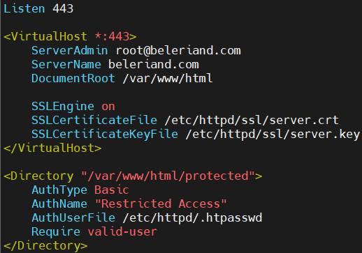

# Apache, SELinux & Firewalld Tasks – Zeynalabdin Hamidov

Secure Apache HTTPD deployment with multiple virtual hosts, SELinux enforcement, Firewalld configuration (zones & custom services), HTTPS, HTTP→HTTPS redirection, Basic Authentication, and connectivity tests.

---

## Environment & Prereqs

```bash
# RHEL 8/9
sudo dnf install -y httpd mod_ssl policycoreutils-python-utils firewalld openssl httpd-tools

# Ensure services are running
sudo systemctl enable --now httpd firewalld
sudo getenforce         # should be Enforcing
sudo firewall-cmd --state
```

---

## Task 1 — Virtual Host on Port 80 (Default docroot)

**Domain example: mordor.com.**
**Requirement: index.html must contain <Karabagh is Azerbaijan!> and live in the /var/www/mordor.com/ location.**

```bash
# Create index.html with required content
echo 'Karabagh is Azerbaijan!' | sudo tee /var/www/mordor.com/index.html
sudo restorecon -Rv /var/www/html
```

**VHost config — /etc/httpd/conf.d/mordor.com.conf**
```bash
<VirtualHost *:80>
    ServerAdmin root@mordor.com
    DocumentRoot /var/www/mordor.com
    ServerName mordor.com
</VirtualHost>
```


```bash
# Open HTTP service and apply
sudo firewall-cmd --permanent --add-service=http
sudo firewall-cmd --reload
sudo systemctl restart httpd
```
**Verify**
```bash
curl -I http://mordor.com
curl http://mordor.com
```


---

## Task 2 — Virtual Host on Port 8282 (Custom docroot + SELinux + Firewalld)

**Domain example: custom.example.com**
**Requirement: index.html at /myapache and must contain RHCSA is my next step; SELinux & Firewalld properly configured.**

```bash
# Create content
sudo mkdir -p /myapache/isengard.com
echo "RHCSA is my next step" | sudo tee /myapache/isengard.com/index.html

# SELinux context for custom docroot
sudo semanage fcontext -a -t httpd_sys_content_t "/myapache(/.*)?"
sudo restorecon -Rv /myapache

# Allow Apache to bind non-standard HTTP port under SELinux
sudo semanage port -a -t http_port_t -p tcp 8282 2>/dev/null || \
sudo semanage port -m -t http_port_t -p tcp 8282
```

```bash
Listen 8282
<VirtualHost *:8282>
    ServerAdmin root@isengard.com
    DocumentRoot /myapache/isengard.com
    ServerName isengard.com
</VirtualHost>
```


```bash
# Open port 8282 in the firewall
sudo firewall-cmd --permanent --add-port=8282/tcp
sudo firewall-cmd --reload
sudo systemctl restart httpd
```
**Verify**
```bash
semanage port -l | grep http_port_t | grep 8282
curl -I http://isengard.com:8282
curl http://isengard.com:8282
```


---

## Task 3 — Virtual Host on Port 443 (HTTPS with self-signed cert)

**Use Task 1’s index.html as the content for HTTPS vhost.**

```bash
# Generate self-signed certificate (1 year)
sudo openssl req -newkey rsa:2048 -nodes \
  -keyout /etc/httpd/ssl/server.crt \
  -x509 -days 365 \
  -out /etc/httpd/ssl/server.key \
  -subj "/C=AZ/ST=Baku/L=Baku/O=Example/OU=IT/CN=secure.example.com"
```

**VHost config — /etc/httpd/conf.d/vhost-ssl.conf**
```bash
<VirtualHost *:443>
    ServerAdmin root@beleriand.com
    ServerName beleriand.com
    DocumentRoot /var/www/beleriand.com

    SSLEngine on
    SSLCertificateFile /etc/httpd/ssl/server.crt
    SSLCertificateKeyFile /etc/httpd/ssl/server.key
</VirtualHost>
```


```bash
# Open HTTPS service and apply
sudo firewall-cmd --permanent --add-service=https
sudo firewall-cmd --reload
sudo systemctl restart httpd
```
**Verify**
```bash
openssl x509 -in /etc/httpd/ssl/server.crt -noout -text | head -n 15
curl -kI https://beleriand.com
curl -k https://beleriand.com
```


---

## Task 4 — Redirect HTTP (80) → HTTPS (443) for Task 1 domain

**Update /etc/httpd/conf.d/mordor.com.conf**
```bash
<VirtualHost *:80>
    ServerAdmin root@mordor.com
    DocumentRoot /var/www/html
    ServerName mordor.com
    Redirect permanent / https:///192.168.153.139
</VirtualHost>
```


```bash
sudo systemctl restart httpd
```
**Verify**
```bash
curl -I http://mordor.com
# Expect: HTTP/1.1 301/308 ... Location: https://beleriand.com/
```

---

## Task 5 — Protect /var/www/html/protected with Basic Authentication

```bash
sudo mkdir -p /var/www/html/protected
sudo htpasswd -c /etc/httpd/.htpasswd annatar   # will prompt for password
sudo restorecon -Rv /var/www/html /etc/httpd/.htpasswd
```
**Add to the HTTPS vhost**
```bash
<Directory "/var/www/html/protected">
    AuthType Basic
    AuthName "Restricted Area"
    AuthUserFile /etc/httpd/.htpasswd
    Require valid-user
</Directory>
```


```bash
sudo systemctl restart httpd
```
**Verify**
```bash
curl -k https://beleriand.com/protected/        # should prompt (401) without creds
curl -k -u annatar:YOURPASS https://beleriand.com/protected/
```


---

## Task 6 — Firewalld

### 6.1 Create a new zone and set it as default

```bash
sudo firewall-cmd --new-zone=yenizone --permanent
sudo firewall-cmd --reload

sudo firewall-cmd --get-zones
sudo firewall-cmd --set-default-zone=yenizone
```

### 6.2 Create a new service file (Custom 8282) and allow it

**Create /etc/firewalld/services/yeniservice.xml**
```bash
<?xml version="1.0" encoding="utf-8"?>
<service>
  <short>YeniService</short>
  <description>Custom Apache port 8282</description>
  <port protocol="tcp" port="8282"/>
</service>
```


```bash
# Make firewalld aware of the new service and allow it
sudo firewall-cmd --permanent --add-service=YeniService
sudo firewall-cmd --reload
```

---