# Disk, VG, LV Tasks – Zeynalabdin Həmidov

Practical tasks for working with block devices, LVM, filesystems, mounts, and swap.

---

## Part 1 – LVM and Mounts

### 1. Check mounted disks (two ways) and CD-ROM status
```bash
df -h
cat /proc/mounts
```
> If `/dev/sr0` appears, CD-ROM is mounted. No `/dev/cdrom` entry means no symlink for that.

Also useful:
```bash
findmnt
lsblk
```

---

### 2. Add two new disks
- **Disk 1:** 5 GB → will be used for `vg_test`
- **Disk 2:** 4 GB → will be split into 2 partitions later

---

### 3. Create `vg_test` Volume Group from 5 GB disk
```bash
sudo pvcreate /dev/sdb
sudo vgcreate vg_test /dev/sdb
```
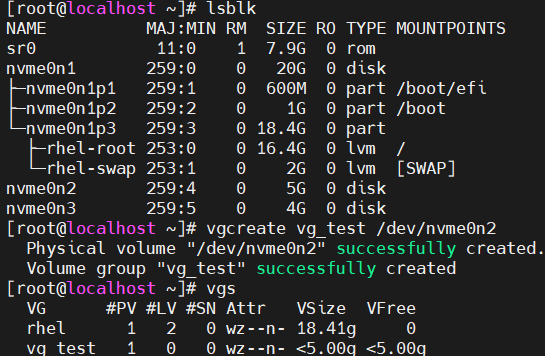

---

### 4. Create two Logical Volumes
- **lvtest1** – 2 GB
- **lvtest2** – 3 GB
```bash
sudo lvcreate -L 2G -n lvtest1 vg_test
sudo lvcreate -L 3G -n lvtest2 vg_test
```
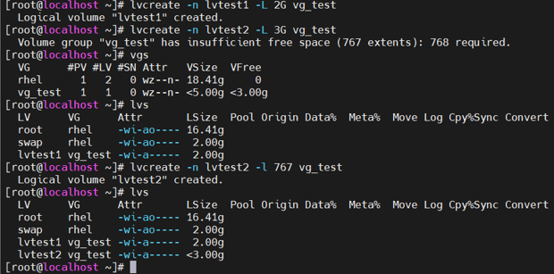

---

### 5. Create filesystems
```bash
sudo mkfs.ext4 /dev/vg_test/lvtest1
sudo mkfs.xfs  /dev/vg_test/lvtest2
```
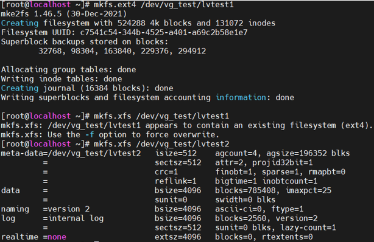

---

### 6. Prepare mount directories & create initial files
```bash
sudo mkdir /dir1 /dir2
sudo touch /dir1/zeynalabdin
sudo touch /dir2/zeynalabdin
```
These files will disappear once the new filesystems are mounted, because they belong to the old underlying filesystem.

---

### 7. Mount LVs
```bash
sudo mount /dev/vg_test/lvtest1 /dir1
sudo mount /dev/vg_test/lvtest2 /dir2
```
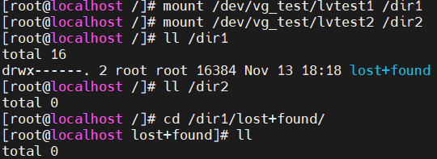

Verify:
```bash
df -h | grep dir[12]
```
Now recreate files:
```bash
sudo touch /dir1/hamidov
sudo touch /dir2/hamidov
```

---

### 8. Partition 4 GB disk
```bash
sudo fdisk /dev/nvme0n3
```
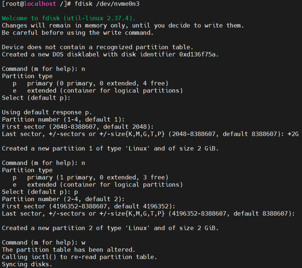

---

### 9. Extend `vg_test` with `nvme0n3p1`
```bash
sudo vgextend vg_test /dev/nvme0n3p1
```
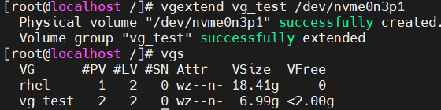

---

### 10. Create second VG with custom PE size (16 MB)
```bash
sudo vgcreate vg_test2 /dev/nvme0n3p2 -s 16M
sudo lvcreate -l 100%VG -n lvtest2 vg_test2
sudo mkfs.xfs /dev/vg_test2/lvtest2
sudo mkdir /oradata
```
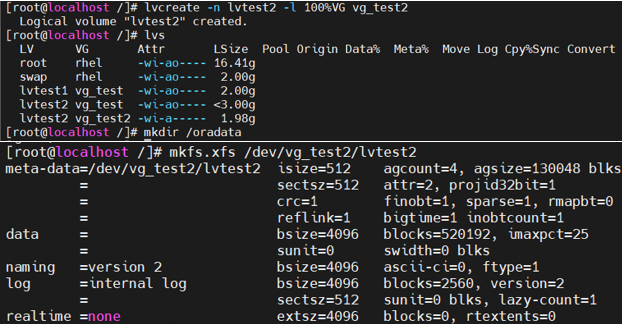

Mount permanently:

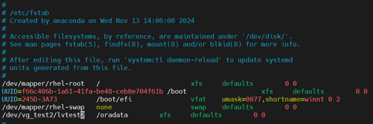

Test:
```bash
sudo mount -a
```

---

### 11. Reboot and check mounts
After reboot:
```bash
df -h
```
- `/oradata` will be mounted automatically (in fstab)
- `/dir1` and `/dir2` will not be mounted unless added to `/etc/fstab`

---

### 12. Auto-mount after reboot
Add entries to `/etc/fstab`:
```fstab
UUID=<uuid_lvtest1> /dir1 ext4 defaults 0 0
UUID=<uuid_lvtest2> /dir2 xfs  defaults 0 0
```

---

## Part 2 – Swap

### 1. Add new disk for swap
```bash
sudo vgcreate vg_swap /dev/nvme0n4
sudo lvcreate -l 100%VG -n lv_swap vg_swap
sudo mkswap /dev/vg_swap/lv_swap
```
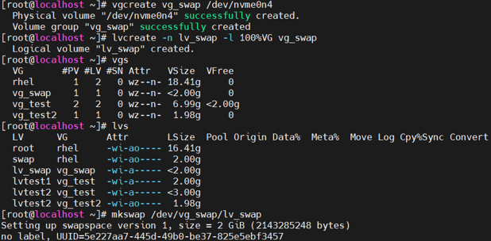

### 2. Enable new swap alongside existing
```bash
sudo swapon /dev/vg_swap/lv_swap
```
Make it permanent in `/etc/fstab`:
```fstab
UUID=<uuid_swap> none swap sw 0 0
```
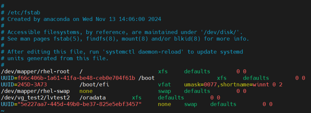

---

### 3. Verify fstab entries
```bash
swapon --show
```
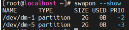

---

### 4. `/etc/fstab` vs `/etc/mtab`
- **fstab** – config file listing filesystems to be mounted automatically
- **mtab** – current list of mounted filesystems (runtime info)

---

### 5. `defaults` and other mount options
- `defaults` = `rw,suid,dev,exec,auto,nouser,async`
- `_netdev` = wait for network before mounting
- `ro` = read-only
- `noexec` = block binary execution from filesystem

---

### 6. Remount with new options without unmounting
```bash
sudo mount -o remount,ro,noexec /mountpoint
mount | grep /mountpoint
```

---

### 7. Partition table
- Located at start of disk
- **MBR** → max 4 primary partitions (or 3 primary + 1 extended with logical partitions)
- **GPT** → up to 128 partitions, supports >2 TB, stores table in two places for redundancy

---

### 8. Why `/boot` is on physical partition, not LVM
`/boot` must load before LVM drivers; hence, it is on a plain physical partition.

---