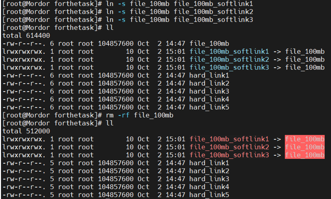

# Environment Variables & Linking – Zeynalabdin Hamidov

This document contains tasks related to Linux environment variables, their scope, and file linking concepts.

---

## Task 1: Check if Last Command Was Successful

**Question:**  
You are writing a bash script and need to check if the last command ran successfully. How?

**Answer:**  
Check the **exit status** using:
```bash
echo $?
```

- `0` = success  
- Non-zero = error

---

## Task 2: Set Temporary Variables in One Session

**Commands:**
```bash
number=11
color=blue
```


Now, in another terminal session, run:

```bash
echo $number
echo $color
```


**Expected Result:**
```
(no output)
```

**Explanation:**  
The variables are not available in the second session because they weren't exported or saved in `.bashrc` or `.profile`.

---

## Task 3: Set Global Variable for All Users

**Goal:** Set `mydata=/opt/mydata` globally

**Command:**
```bash
echo "export mydata=/opt/mydata" >> /etc/profile
source /etc/profile
```

---

## Task 4: Files That Store Environment Variables

| Scope | Files |
|-------|-------|
| User-specific | `~/.bashrc`, `~/.bash_profile` |
| System-wide   | `/etc/profile`, `/etc/bashrc` |

---

## Task 5: Which Value Wins – User or Global?

```bash
# Global
Name=alibaba

# User-specific (e.g. in ~/.bashrc)
Name=aliexpress
```

**Result:**
```bash
echo $Name
# Output: aliexpress
```

**Explanation:**  
User-specific values override globally set ones.

---

## Task 6: Show All Environment Variables

**Command:**
```bash
env
```

---

## Task 7: Create Alias Script in `/etc/profile.d/`

1. Create file:
```bash
nano /etc/profile.d/myalias.sh
```

2. Inside the file, write:
```bash
alias lm='ls -la'
```


3. Save and reload:
```bash
source /etc/profile.d/myalias.sh
```

4. Test it:
```bash
lm
```


---

## Task 8: Add User `apple` and Configure Environment

**Commands:**
```bash
useradd apple
passwd apple
```

Switch to the new user:
```bash
su - apple
```

---

## Task 9: Set JAVA_HOME Permanently for User `apple`

**As user `apple`:**

1. Create directories (as root):
```bash
mkdir -p /usr/java/java_11/bin
```

2. Switch to user:
```bash
su - apple
```

3. Open `.bash_profile`:
```bash
nano ~/.bash_profile
```

4. Add lines at the end:
```bash
export JAVA_HOME=/usr/java/java_11
export PATH=$JAVA_HOME/bin:$PATH
```

5. Save and reload:
```bash
source ~/.bash_profile
```

6. Test:
```bash
echo $JAVA_HOME
which java
```

**Expected Output:**
```
/usr/java/java_11
/usr/java/java_11/bin/java
```

**Note:** You can use `touch /usr/java/java_11/bin/java` to simulate a fake binary just for test.

---

# Task 10: Inode and File Linking

---

## What is an inode?

An **inode** is a data structure that stores metadata about files:
- File size
- Ownership
- Permissions
- Time stamps
- Location of data blocks

---

## Create a 100MB file using `dd`

**Command:**
```bash
dd if=/dev/zero of=samplefile bs=1M count=100
```

**Explanation:**  
This creates a 100MB file named `samplefile` filled with zeros.

---

## Create 5 Hard Links

**Command:**
```bash
for i in {1..5}; do ln file100mb hardlink$i; done
```

**Check inodes:**
```bash
ls -li
```


**Expected Output:**
Each file has the **same inode number** as `samplefile`.

---

## How much disk space do they use?

Even with 5 links, they still take up only **100MB total**, because all point to the same inode/data.

---

## What happens if you delete the original file?

Nothing — hard links continue to work because they all refer to the **same inode**.

---

## What does an inode contain?

- Data block locations
- Permissions
- Timestamps
- UID / GID
- Not the filename (which is stored in directory entry)

---

## Can you create hard links across partitions?

**No.**  
Hard links must stay on the **same filesystem/partition**, because inode numbers are local to each disk.

---

## Try creating hard link from `/boot` to `/opt`

**Command:**
```bash
ln /boot/vmlinuz-* /opt/
```

**Result:**  
Fails with:
```
Invalid cross-device link
```


**Explanation:**  
Because `/boot` and `/opt` are likely on different partitions.

---

## Create a soft link and delete original

**Commands:**
```bash
ln -s /etc/passwd softlink
rm /etc/passwd
ls -l softlink
```


**Result:**  
The symlink becomes **broken**, pointing to a non-existent target.

