# Linux Basics – Zeynalabdin Hamidov

This file contains basic Linux administration tasks completed as part of foundational training.

---

## 1. What is the IP address of your Linux machine?

**Command:**
```bash
ip a
```

**Sample Output:**
```
192.168.153.130
```
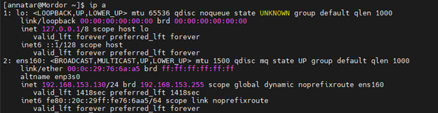

---

## 2. Connect from Windows host using PuTTY via SSH

**Command:**
```bash
ssh annatar@192.168.153.130
```

---

## 3. Show open ports using netstat (LISTEN ports only)

**Command:**
```bash
netstat -tulnp | grep LISTEN
```
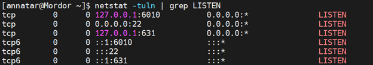

**Explanation:**
This command lists all open ports that are currently in a LISTEN state, showing the services using them.

---

## 4. Telnet to one of the open (LISTEN) ports from Windows

**Command (from Windows Command Prompt):**
```cmd
telnet 192.168.153.130 <port>
```
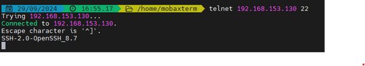

**Note:** Replace `<port>` with an actual open port number (e.g., 22 for SSH). You need to enable the **Telnet client** on Windows if it's not installed.

---

## 5. Check current directory after login with root

**Command:**
```bash
pwd
```
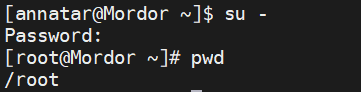

**Sample Output:**
```
/root
```

**Explanation:**
The `pwd` command shows the present working directory. By default, root lands in `/root`.

---

## 6. Check if `nslookup` is available

**Command:**
```bash
which nslookup
```

**Explanation:**
Checks if the `nslookup` binary exists and shows its path if installed.

---

## 7. If not available, install `nslookup`

**Command:**
```bash
yum whatprovides nslookup
yum install bind-utils
```

**Note:** `bind-utils` is the package that provides `nslookup`.

---

## 8. Run nslookup for a domain

**Command:**
```bash
nslookup www.az
```
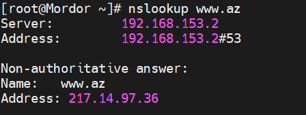

**Sample Output:**
```text
Server:         192.168.1.1
Address:        192.168.1.1#53

Non-authoritative answer:
Name:   www.az
Address: 104.21.20.122
Name:   www.az
Address: 172.67.0.62
```

---

## 9. Create nested folder path `/folder1/f2/f3/f4/f5` in one command

**Command:**
```bash
mkdir -p /folder1/f2/f3/f4/f5
```

**Explanation:**
`-p` creates parent directories as needed.

---

## 10. What happens if you run `rm -rf /*`

**Answer:**
This command recursively and forcefully deletes **everything** on the system, including system files. It will make the OS unusable.

> **NEVER run this on a production or active machine!**

---

## 11. Change directory to `/tmp`, then to `/etc/sysconfig/network-scripts`

**Commands:**
```bash
cd /tmp
cd /etc/sysconfig/network-scripts
```

---

## 12. Difference between `cd -` and `cd ..`

**Answer:**
- `cd -` returns you to the **previous directory**
- `cd ..` moves you **one level up** in the directory structure

---

## 13. Meaning of `cd ~` and `cd .`

**Commands:**
```bash
cd ~
cd .
pwd
```

**Explanation:**
- `cd ~` takes you to the home directory of the current user.
- `cd .` means “current directory”, so it doesn’t change anything.

---

## 14. Meaning of `-r` and `-f` options in `rm` command

**Answer:**
- `-r` (recursive): removes directories and their contents
- `-f` (force): skips prompts and deletes without confirmation

**Example:**
```bash
rm -rf /tmp/test-folder
```

---

## 15. Create a file `rhcsa.red` under root’s home, rename it to `rhcsa.blue`

**Commands:**
```bash
touch /root/rhcsa.red
mv /root/rhcsa.red /root/rhcsa.blue
```

---

## 16. Copy file to `/tmp` without changing permissions

**Command:**
```bash
cp -p /root/rhcsa.blue /tmp/
```

**Explanation:**
The `-p` option preserves file mode, ownership, and timestamps.

---

## 17. Check disk usage: `df` vs `du`

**Command:**
```bash
df -h
du -sh /path/to/dir
```

**Explanation:**
- `df`: shows disk space usage per file system (with `-h` = human-readable)
- `du`: shows disk usage of files/directories

---

## 18. Show OS distro and kernel version

**Distro Name:**  
Red Hat Enterprise Linux

**Kernel Version:**
```
5.14.0-70.22.1.el9_0.x86_64
```

**Command to check kernel version:**
```bash
uname -a
```

---

## 19. Logout from current SSH session

**Command:**
```bash
exit
```

**Explanation:**
This exits the current shell session, closing the SSH connection.

---

## 20. Find `sshd_config` file under `/etc`

**Command:**
```bash
find /etc -name sshd_config
```
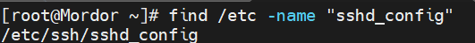

---

## 21. Show the 15th line of `sshd_config`

**Command:**
```bash
head -n 15 /etc/ssh/sshd_config | tail -n 1
```
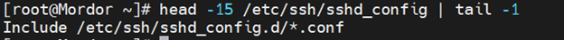

**Explanation:**
- `head -n 15`: get the first 15 lines
- `tail -n 1`: take the last of those = line 15

---

## 22. Archive `/root/mydir` and list contents of tar file

**Commands:**
```bash
mkdir /root/mydir
cp /etc/hosts /root/mydir/
tar -cvf mydir.tar /root/mydir
tar -tf mydir.tar
```
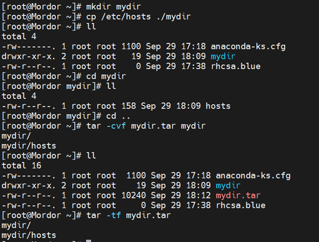

---

## 23. Use history and run previous commands

**Commands:**
```bash
history
!20       # runs the 20th command in history
!!        # repeats the last command
```
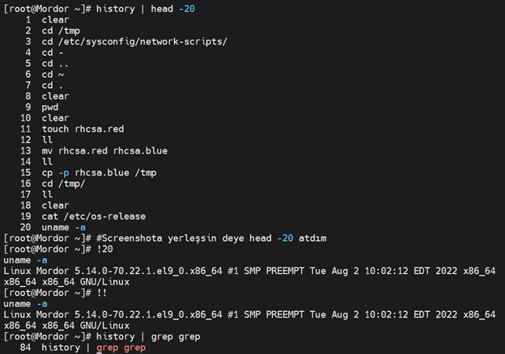

**Explanation:**
- `!20` runs the 20th command from `history`
- `!!` runs the most recent command again

---

## 24. Search previous commands with `grep`

**Command:**
```bash
history | grep grep
```

**Explanation:**
Searches your command history for any line that includes `grep`

---

## 25. Use grep to find lines with “port” in `/etc/ssh`

**Case-sensitive:**
```bash
grep port /etc/ssh/*
```
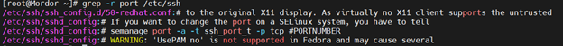

**Case-insensitive:**
```bash
grep -i port /etc/ssh/*
```
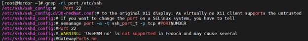

---

## 26. Try other `grep` options: `-A`, `-B`, `-C`, `-w`, etc.

**Examples:**
```bash
grep -A 2 port /etc/ssh/sshd_config   # show 2 lines after match
grep -B 2 port /etc/ssh/sshd_config   # show 2 lines before
grep -C 2 port /etc/ssh/sshd_config   # show 2 lines before & after
grep -w port /etc/ssh/sshd_config     # match whole word "port"
```

---

## 27. Monitor `/var/log/secure` in one session, use `su - root` in another

**Command (monitoring):**
```bash
tail -f /var/log/secure
```
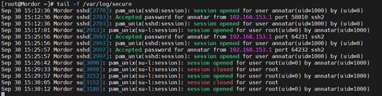

**In another SSH window, run:**
```bash
su - root
```

**Explanation:**
You’ll see login attempts appear live in `/var/log/secure`

---

## 28. Why install `bash-completion`?

**Answer:**
It enables tab completion for commands, arguments, and paths — improving speed and accuracy.

---

## 29. List all files in `/root`, including hidden ones

**Command:**
```bash
ls -la /root
```
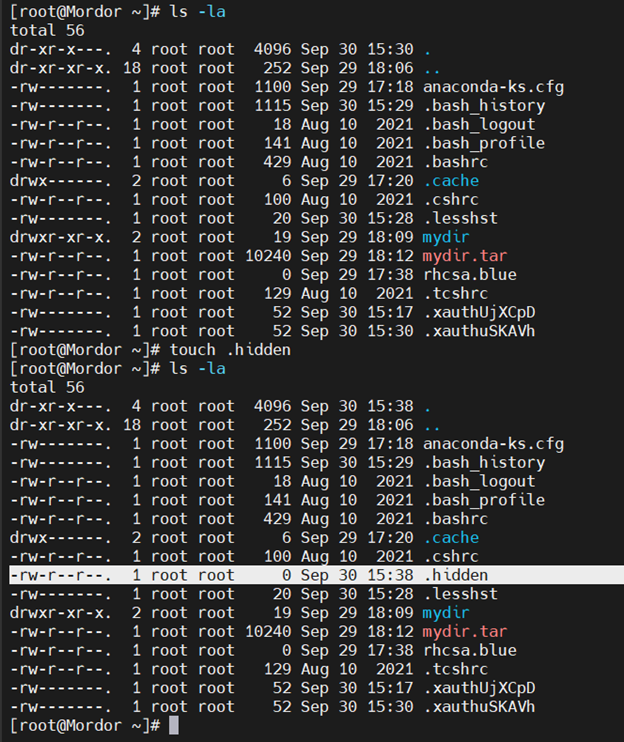

**Explanation:**
Hidden files start with a `.` in Linux.

---

## 30. Create a new hidden file

**Command:**
```bash
touch /root/.hiddenfile
```

---

## 31. Practice `echo`, `>` and `>>` redirection

**Commands:**
```bash
echo salam
echo "Linux was created by Linus Torvalds" > bio.txt
echo "Idtech Academy RHCSA Session" > session.txt
cat session.txt
echo "Idtech Academy RHCE and DevOPS Session" >> session.txt
cat session.txt
```

---

## 32. Shell variables and output

**Commands:**
```bash
a=5
color=blue
echo $a       # prints 5
echo a        # prints "a"
echo $color   # prints "blue"
```

**Explanation:**
- `$var` gives the value of a variable
- `echo var` prints literal text
