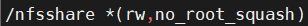
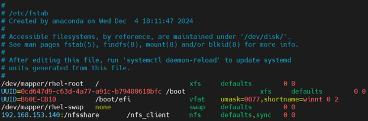
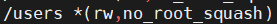
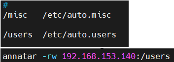
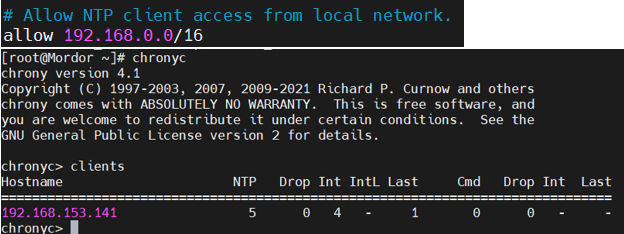
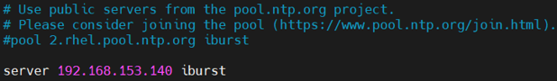

# NFS & NTP Tasks – Zeynalabdin Hamidov

NFS server/client configuration (including per-user automount) and NTP setup with correct timezone.

---

## Part 1 — NFS

### 1) Share `/nfsshare` from the server and mount permanently on client

**Server (RHEL8/9):**
```bash
sudo dnf install -y nfs-utils
sudo mkdir -p /nfsshare
sudo chown root:root /nfsshare
echo "/nfsshare  *(rw,no_root_squash)" | sudo tee -a /etc/exports
```


```bash
sudo systemctl enable --now nfs-server
sudo exportfs -rav
sudo firewall-cmd --add-service=nfs --permanent
sudo firewall-cmd --reload
```

**Client:**
```bash
sudo dnf install -y nfs-utils
sudo mkdir -p /mnt/nfsshare
# Test mount
sudo mount -t nfs <SERVER_IP>:/nfsshare /mnt/nfsshare

# Make permanent
echo "<SERVER_IP>:/nfsshare  /nfs_client  nfs  defaults,sync  0  0" | sudo tee -a /etc/fstab
sudo systemctl daemon-reload
sudo mount -a
```



> **Verify**
```bash
mount | grep nfsshare
touch /mnt/nfsshare/test_from_client
```

---

### 2) Share `/users` and auto-mount per-user subfolder on the client

Goal: When a user enters `/users/<username>` on the **client**, it auto-mounts that user’s subfolder from the **server**.

**Server:**
```bash
sudo mkdir -p /users
# Example: prepare per-user dirs (adjust names)
sudo mkdir -p /users/annatar
sudo chown annatar:annatar /users/annatar

# Export
echo "/users  *(rw,no_root_squash)" | sudo tee -a /etc/exports
sudo exportfs -rav
```



**Client (with autofs):**
```bash
sudo dnf install -y autofs nfs-utils
# Indirect map: /users/<name> will mount <SERVER>:/users/<name>
echo "/users  /etc/auto.users" | sudo tee /etc/auto.master
echo "annatar  -rw  <SERVER_IP>:/users" | sudo tee /etc/auto.users
sudo systemctl enable --now autofs
```


> **Test (client):**
```bash
ls /users           # shows nothing until accessed
ls /users/lisa      # triggers mount of /users/lisa
mount | grep '/users/'
```

---

## Part 2 — NTP (chrony)

### 3) Configure NTP server and set timezone to Asia/Baku

**Server:**
```bash
sudo dnf install -y chrony
sudo timedatectl set-timezone Asia/Baku

# Allow your LAN to query this server; example 192.168.153.0/24
sudo sed -i '/^#*allow /d' /etc/chrony.conf
echo "allow 192.168.0.0/16" | sudo tee -a /etc/chrony.conf
# (Optional) act as local stratum if isolated:
# echo "local stratum 10" | sudo tee -a /etc/chrony.conf

sudo systemctl enable --now chronyd
chronyc
```


**Firewall (server):**
```bash
sudo firewall-cmd --add-service=ntp --permanent
sudo firewall-cmd --reload
```

---

### 4) Configure client to sync time from the server

**Client:**
```bash
sudo dnf install -y chrony
sudo timedatectl set-timezone Asia/Baku
# Replace any pool/server lines with your server:
sudo sed -i 's/^pool .*/#&/' /etc/chrony.conf
sudo sed -i 's/^server .*/#&/' /etc/chrony.conf
echo "server <SERVER_IP> iburst" | sudo tee -a /etc/chrony.conf
```


```bash
sudo systemctl enable --now chronyd
sleep 2
chronyc sources
chronyc tracking
timedatectl
```

> **Expected:** `chronyc sources` shows your `<SERVER_IP>` as a time source and `timedatectl` reports the correct timezone and that NTP is active.

---