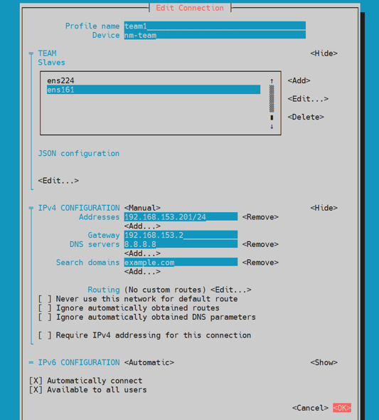

# Network Tasks – Zeynalabdin Hamidov

Practical networking tasks in Linux, covering IP configuration, interface management, DNS, routing, and NIC teaming.

---

## 1. Configure Static IP and Hostname

**Example configuration** (replace `X` with your network segment):

- Static IP: `172.25.X.11`
- Netmask: `255.255.255.0`
- Default gateway: `172.25.X.254`
- Primary DNS: `172.X.254.254`
- DNS search path: `example.com`
- Hostname: `serverX.example.com`

**Using nmtui:**
```bash
sudo nmtui
# Edit connection
# Set IPv4 configuration to Manual
# Enter IP address, Netmask, Gateway, DNS, and Search domain
# Set hostname to serverX.example.com
# Save and quit
```

**Verification:**
```bash
hostnamectl
ip a
ip route
cat /etc/resolv.conf
```


---

## 2. Add a New Network Interface (VMware Bridge)

1. Add a network adapter in VMware and set it to **Bridge** mode.
2. Detect its name from logs:
```bash
sudo cat /var/log/messages | grep -i "network"
```


**Example Result:**
```
manager: (eth0): new Ethernet device (/org/freedesktop/NetworkManager/Devices/4)
device (eth0): interface index 4 renamed iface from 'eth0' to 'ens256'
```

---

## 3. Check Interface Status by Connect/Disconnect

- Disconnect → verify it goes **DOWN**
- Connect → verify it comes **UP**

```bash
nmcli dev status
```

---

## 4. Assign IP to the New Interface

Using nmtui/nmcli/ifconfig or by editing the config file.

Example with `nmcli`:
```bash
sudo nmcli con mod ens256 ipv4.addresses 192.168.153.20/24
sudo nmcli con mod ens256 ipv4.gateway 192.168.153.2
sudo nmcli con mod ens256 ipv4.method manual
sudo nmcli con up ens256
```

---

## 5. Enable Auto-Connect on Boot

In `nmcli`:
```bash
sudo nmcli con mod ens256 connection.autoconnect yes
```

In `nmtui`, check **Automatically connect** option.

---

## 6. Set Default Gateway and Test Connectivity

**Command:**
```bash
ip route add default via 192.168.153.2
ping -c 4 192.168.153.2
```

---

## 7. Add DNS Without Editing `/etc/sysconfig/network-scripts`

Instead, edit the `NetworkManager` connection file:
```bash
sudo nano /etc/NetworkManager/system-connections/ens256.nmconnection
# Add:
# dns=8.8.8.8;
```
Or use `nmcli`:
```bash
sudo nmcli con mod ens256 ipv4.dns "8.8.8.8"
sudo nmcli con up ens256
```

---

## 8. Test DNS Resolution

**Tools:**
```bash
nslookup box.az
dig box.az
host box.az
```


**Expected:** All three commands resolve the IP address.

---

---

## 9. Deactivate/Activate Interface and Watch Logs

**Deactivate / activate:**
```bash
sudo nmcli con down ens256
sudo nmcli con up ens256
```

**Check logs (live):**
```bash
sudo journalctl -u NetworkManager -f
# or broader:
sudo journalctl -xe -f
```

**Quick status:**
```bash
nmcli con show
nmcli dev status
```


---

## 10. Show LISTEN TCP (and optionally UDP) Ports

**Using `ss` (preferred):**
```bash
ss -tulnp | grep LISTEN
```

**Using `netstat`:**
```bash
netstat -tulnp | grep LISTEN
```

**Note:** drop `-u` if you want TCP only.

---

## 11. Add a Route for 8.8.8.8 via Your Gateway

**Add route (temporary):**
```bash
sudo ip route add 8.8.8.8/32 via 192.168.153.2 dev ens256
```

**Verify:**
```bash
ip route get 8.8.8.8
ip route
ping -c 2 8.8.8.8
```

---

## 12. Check Route Table and Delete the Added Route

**Show routes:**
```bash
ip route
```

**Delete route:**
```bash
sudo ip route del 8.8.8.8/32 via 192.168.153.2 dev ens256
```

**Verify removal:**
```bash
ip route get 8.8.8.8
```


---

## 13. Create a Team (Bond) With Two NICs (NetworkManager)

> Using **nmtui** (simple) or **nmcli** (scriptable). Below shows both.

### Option A — nmtui (TUI)
```text
sudo nmtui
→ Edit a connection
→ Add → Team
  - Name: team1
  - IPv4: Manual (set address/gw/DNS/search)
  - Save
→ Edit team1 → Add slave → select nic1 (e.g., ens257)
→ Edit team1 → Add slave → select nic2 (e.g., ens258)
→ Save and Quit
sudo nmcli con up team1
```


**Verify team status:**
```bash
nmcli con show
nmcli dev show
ip a show team1
```


---