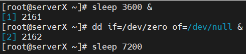
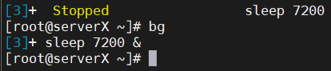
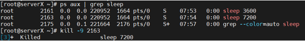
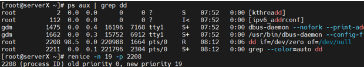
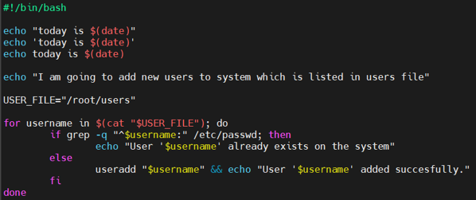

# Processes & Crontab – Zeynalabdin Həmidov

Practical tasks on job control, priorities, cron/at scheduling, and system load.

---

## 1) Start background jobs
```bash
sleep 3600 &
dd if=/dev/zero of=/dev/null &
sleep 7200
```


Temporarily stop the **foreground** `sleep 7200`:
- Press **Ctrl+Z** (sends SIGTSTP)
- Then send to background:
```bash
bg %1      # or just: bg
jobs
```


---

## 2) Find PID and kill the last process
Find the PID (example for `sleep`):
```bash
ps aux | grep 'sleep'
# or
pgrep -a sleep
```
Kill it:
```bash
kill -15 <PID>   # graceful
kill -9  <PID>   # force (only if needed)
```


---

## 3) Use `jobs`, move job to foreground, then kill
```bash
jobs
fg %1            # bring job 1 to foreground
# Ctrl+C         # to stop it
```

---

## 4) Lower priority (increase nice) for `dd`
Get PID:
```bash
ps aux | grep dd
```
Set minimum priority (highest nice = 19):
```bash
sudo renice -n 19 -p <PID>
```


---

## 5) PID of `systemd` and UID of root
- `systemd` PID = **1**
- root UID = **0**

Check:
```bash
ps -p 1 -o pid,comm,user
id -u root
```

---

## 6) What is PPID?
**PPID** = Parent Process ID (PID of the process that spawned this one).  
See PID/PPID:
```bash
ps -ef | head
```

---

## 7) Script to clean `/tmp` and cron schedule (root)
> ⚠️ Be careful: this **deletes everything** under `/tmp`.

Create script:
```bash
sudo tee /usr/local/sbin/clean_tmp.sh >/dev/null <<'EOF'
#!/bin/bash
find /tmp -mindepth 1 -maxdepth 1 -exec rm -rf {} +
EOF
sudo chmod +x /usr/local/sbin/clean_tmp.sh
```

Crontab (root): **every Sunday at 03:15**
```bash
sudo crontab -e
# add:
15 3 * * 0 /usr/local/sbin/clean_tmp.sh
```

---

## 8) Run a script 5 times per hour
Every 12 minutes:
```cron
*/12 * * * * /path/to/script.sh
```

---

## 9) Run a script every 30 seconds
Crontab can’t schedule seconds directly. Use two entries with `sleep`:
```cron
* * * * * /path/to/script.sh
* * * * * sleep 30; /path/to/script.sh
```
(Alternative: a systemd timer set to 30s if allowed.)

---

## 10) Test cron at reboot
Crontab entry (run once after boot, delayed 1 min):
```cron
@reboot sleep 60; /path/to/script.sh
```

---

## 11) Show `sasha` user’s cron as root
```bash
sudo crontab -u sasha -l
```

---

## 12) Saturday midnight script (root)
Create users from a file if not exists, and log:



Set Permission
```bash
sudo chmod +x /usr/local/sbin/saturday_users.sh
```

Crontab (root) – **Saturday 00:00**:
```cron
0 0 * * 6 /usr/local/sbin/saturday_users.sh >> /var/log/saturday_users.log 2>&1
```

---

## 13) `atd` example (one-off job)
Ensure `atd` is running:
```bash
sudo systemctl enable --now atd
```
Run a job 2 minutes from now:
```bash
echo "/path/to/script.sh" | at now + 2 minutes
atq         # list queued jobs
atrm <id>   # remove job
```

---

## 14) Process tools to know
```bash
ps aux
ps -ef
ps -fu <username>
top
uptime
pidof <process>
```

---

## 15) `kill -15` vs `kill -9`
- **SIGTERM (15)**: ask process to terminate gracefully (cleanup possible)
- **SIGKILL (9)**: force kill immediately (no cleanup)

---

## 16) `uptime` and load averages (explain)
```bash
uptime
nproc        # number of CPU cores
```
**Load average** shows runnable+uninterruptible tasks averaged over **1, 5, 15 min**.  
Rule of thumb: On an N-core system, a load of ~N means CPUs are fully busy; well over N means the run queue is backing up.

---