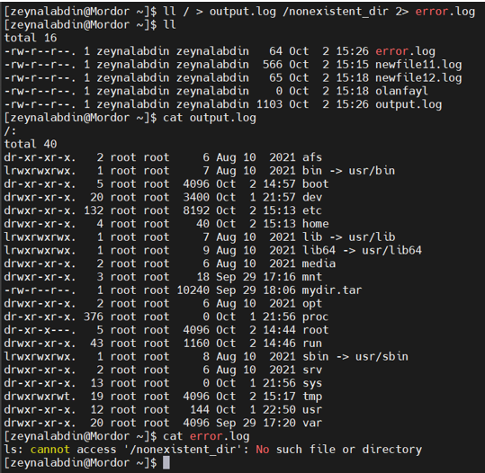

# Redirection of STDIN, STDOUT, and STDERR – Zeynalabdin Hamidov

This document covers practical Linux tasks related to redirecting input/output, handling errors, and understanding shell quoting rules.

---

## 1. Create and Switch to a New User

**Commands:**
```bash
sudo useradd zeynalabdin
sudo passwd zeynalabdin
su - zeynalabdin
```

Check which user you are:
```bash
whoami
```

---

## 2. List All Files (including hidden) in Home Directory and Redirect Output

**Command:**
```bash
ls -la ~ > newfile11.log
```


**Explanation:**  
- `>` overwrites the target file with command output  
- `ls -la` shows files, including hidden ones.

---

## 3. Attempt to Create File in `/etc/sysconfig` as Normal User

**Command:**
```bash
cd /etc/sysconfig
touch newww  >> ~/newfile11.log 2>&1
```


**Explanation:**  
- `>>` appends to the log file instead of overwriting it.  
- `2>&1` sends STDERR to STDOUT so both are logged in `newfile11.log`.

---


## 4. Example Command Producing Both STDOUT and STDERR, Redirecting Separately

**Command:**
```bash
ls / /nonexistent_dir > output.log 2> error.log
```


**Explanation:**  
- `>` sends STDOUT to `output.log`  
- `2>` sends STDERR to `error.log`.

---

## 5. Discard Error Output

**Command:**
```bash
ll /nonexistent_dir 2> /dev/null
```

**Explanation:**  
- `/dev/null` discards anything written to it.

---

## 6. Summary of Redirection Operators

| Operator | Description |
|----------|-------------|
| `>`      | Redirect STDOUT, overwrite file |
| `>>`     | Redirect STDOUT, append to file |
| `1>` / `1>>` | Same as `>` / `>>` (explicit STDOUT) |
| `2>`     | Redirect STDERR, overwrite file |
| `2>>`    | Redirect STDERR, append to file |
| `cmd > file 2>&1` | Redirect both STDOUT and STDERR to same file |
| `cmd >> file 2>&1` | Append both STDOUT and STDERR to same file |
| `cmd > /dev/null` | Discard STDOUT |
| `cmd 2> file1 1> file2` | Redirect STDERR to file1, STDOUT to file2 |
| `cmd1 \| cmd2` | Pipe STDOUT from cmd1 to cmd2 |

---

## 7. What happens with `$` inside strings?

**Examples:**
```bash
x=42
echo $x         # 42  → variable expansion
echo "$x"       # 42  → expansion still happens in double quotes
echo '$x'       # $x  → no expansion in single quotes
```

**Also useful:**
```bash
echo $$         # prints current shell's PID
```

---

## 8. What does multiple `!` mean in Bash history?

```bash
!!              # repeat last command
!42             # run command #42 from history
!ec             # run the last command that started with "ec" (e.g., echo)
```

> Two or more `!` only matter as valid history expansions (e.g., `!!!` is not special by itself unless it matches a pattern like `!!` followed by `!something`).

---

## 9. Quoting rules: `"..."` vs `'...'` vs `` `...` ``

**Double quotes `"..."`**
- Allow **variable** expansion (`$var`)
- Allow **command substitution** `$(...)` and **escape sequences**
- Preserve spaces/newlines in arguments

**Single quotes `'...'`**
- **No** expansions; treat everything literally
- Best when you want the shell to leave text untouched

**Backticks `` `...` `` (legacy command substitution)**
- Execute command and substitute its output
- Prefer modern `$(...)` for readability/nesting

**Examples:**
```bash
name=Zeyn
echo "Hello $name"            # Hello Zeyn
echo 'Hello $name'            # Hello $name
echo "Today is $(date +%F)"   # Substitutes date
echo `date +%F`               # Same, older style
```

---

## 10. Mini practice: combine quoting + redirection

```bash
msg="Hi"
echo "$msg on $(hostname)" >> ~/newfile11.log 2>&1
grep -n "Hi" ~/newfile11.log | head -n 1
```

**Why this is useful:**  
- Safely expands variables/commands  
- Appends logs  
- Pipes results to another command for quick checks

---
