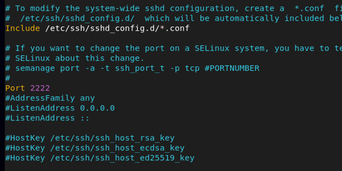
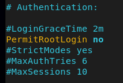
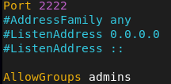
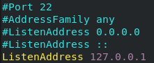

# SSH Tasks – Zeynalabdin Hamidov

Tasks for SSH configuration, security hardening, and key-based authentication.

---

## Pre-configuration (on both servers)
Disable SELinux (test purposes only):
```bash
sudo sed -i 's/^SELINUX=.*/SELINUX=permissive/' /etc/selinux/config
sudo setenforce 0
```

Stop firewall (test purposes only):
```bash
sudo systemctl stop firewalld
sudo systemctl disable firewalld
```

---

## 1. Change SSH Port on Server 1 to 2222
Edit `/etc/ssh/sshd_config`:
```conf
Port 2222
```


Restart SSH:
```bash
sudo systemctl restart sshd
```
> Note: SELinux enforcing will block this unless port is allowed with `semanage`.

---

## 2. Connect from Server 2 to Server 1 via port 2222
```bash
ssh -p 2222 user@server1_ip
```

---

## 3. Copy `/etc/hosts` from Server 2 to `/tmp` on Server 1

**With rsync:**
```bash
rsync -avz -e "ssh -p 2222" /etc/hosts user@server1_ip:/tmp/
```

**With scp:**
```bash
scp -P 2222 /etc/hosts user@server1_ip:/tmp/
```

---

## 4. Restrict SSH Access to `admins` group only

On Server 1:
```bash
sudo groupadd admins
sudo usermod -aG admins user1
sudo usermod -aG admins user2
```
Edit `/etc/ssh/sshd_config`:
```conf
PermitRootLogin no
AllowGroups admins
```



Restart SSH:
```bash
sudo systemctl restart sshd
```

---

## 5. Connect from Server 2 as `admins` group user
```bash
ssh -p 2222 adminuser@server1_ip
```

---

## 6. Run Command via SSH from Server 1 to Server 2
```bash
ssh -t user@server2_ip "hostname && uptime"
```

---

## 7. Bind SSH to 127.0.0.1 on Server 2
Edit `/etc/ssh/sshd_config`:
```conf
ListenAddress 127.0.0.1
```


Restart SSH:
```bash
sudo systemctl restart sshd
```
Verify:
```bash
netstat -tulnp | grep ssh
```

---

## 8. Enable Passwordless SSH from Server 2 → Server 1

**Generate keys on Server 2:**
```bash
ssh-keygen -t rsa -b 4096
```

**Copy public key to Server 1:**
```bash
ssh-copy-id -p 2222 user@server1_ip
```

Verify:
```bash
ssh -p 2222 user@server1_ip
```

---

## 9. Disable Password Authentication on Server 1
Edit `/etc/ssh/sshd_config`:
```conf
PasswordAuthentication no
```
Restart SSH:
```bash
sudo systemctl restart sshd
```

---
