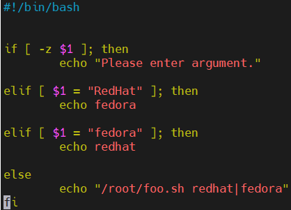
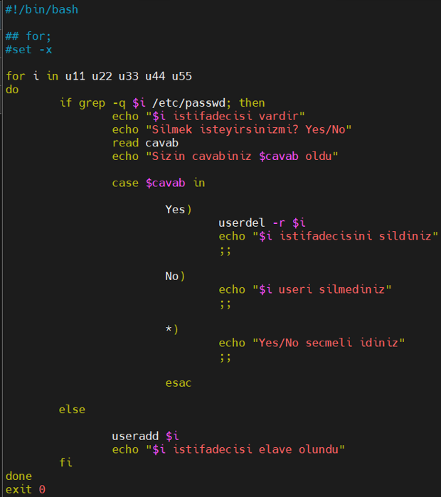

# Bash Scripting Tasks – Zeynalabdin Həmidov

Various shell scripting exercises covering arguments, conditions, loops, file operations, and automation.

---

## 1 – Script `foo.sh`
Requirements:
- If run with `redhat` → print `fedora`
- If run with `fedora` → print `redhat`
- If run with other argument → print `/root/foo.sh redhat|fedora`
- If run without argument → print to **stderr**: `Please enter argument`



---

## 2 – Compare input with 100 & 200
Requirements:
- If the number you entered is more than 200 stdout is “more than 200”
- If the number which you entered is less than 100 stdout is “less than 100”
- If the number is more than 100 and less than 200 then the output is “bingo”


---

## 3 – Argument and permission checks
Requirements:
 - If the argument is not entered, the script should stop and exit with the output “Please enter argument!!!”
 - If the script is not run by root, then the script should stop and exit with the output “This script must run only by root”
 - If the argument count is less than 3, then the script should stop and exit with the output “enter more than 3 arguments”
 - If the argument count is equal to 3 or more than 3, then print all of them 


---

## 4 – Create users from files & backup home directories

**usernames file:**
```
user1
user2
user3
user4
```

**passwords file:**
```
pass1
pass2
pass3
pass4
```

**create_users.sh**


---

## 5 – Disk usage check > 80% sends mail


---

## 6 – User create/delete loop (converted to case)



---