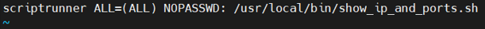

# User & Permissions – Zeynalabdin Hamidov

Tasks on user creation, sudo configuration, group collaboration, ACLs, immutability, password policy, and scripts.

---

## 1) Wheel group vs other groups
Users in the **wheel** group have root-level privileges (via `sudo`). Other groups do not. This group is typically used to control administrative access.

---

## 2) Create `networker` with limited sudo commands
```bash
sudo useradd networker
sudo passwd networker
```
Create a sudoers file:
```bash
visudo -f /etc/sudeors.d/network_file
```


Test:
```bash
su - networker
sudo ip address show
```

---

## 3) Script for IP address + open ports, for `scriptrunner`
```bash
sudo useradd scriptrunner
sudo passwd scriptrunner
sudo tee /usr/local/bin/show_ip_ports.sh <<'EOF'
#!/bin/bash
ip a
ss -tuln
EOF
sudo chmod +x /usr/local/bin/show_ip_ports.sh
```
Sudoers entry:
```bash
sudo visudo -f /etc/sudoers.d/scriptrunner_file
```


---

## 4) Create users lisa, lara, sara + group sales
```bash
sudo useradd lisa
sudo useradd lara
sudo useradd sara
sudo passwd lisa
sudo passwd lara
sudo passwd sara

sudo groupadd sales
sudo usermod -aG sales lisa
sudo usermod -aG sales lara
sudo usermod -aG sales sara
```

---

## 5) Create `/home/myfolder`, set group to sales, and RWX perms
```bash
sudo mkdir /home/myfolder
sudo chgrp sales /home/myfolder
sudo chmod 770 /home/myfolder
```

---

## 6) Group collaboration (setgid bit)
```bash
sudo chmod g+s /home/myfolder
```
This ensures all new files/folders inherit `sales` as the group owner.

---

## 7) Create nested directories recursively
```bash
sudo mkdir -p /home/myfolder/folder1/folder2/folder3
```

---

## 8) Create file and give ACL to wheel group (no execute on file)
```bash
sudo touch /home/myfolder/folder1/folder2/folder3/myfile
sudo setfacl -R -m g:wheel:rwX /home/myfolder/
```

---

## 9) Prevent file deletion by others in `/home/myfolder`
```bash
sudo chmod +t /home/myfolder
```
The **sticky bit** prevents users from deleting files they don’t own.

---

## 10) Make file immutable
```bash
sudo chattr +i /home/myfolder/folder1/folder2/folder3/myfile
```

---

## 11) Backup & restore ACLs
```bash
getfacl -R /home/myfolder > myfolder.acl
sudo mkdir /yourfolder
setfacl --restore=myfolder.acl
```


---

## 12) Login with `-` vs without `-`
- With `-` → simulates a full login shell, loads `.bash_profile`, `.bashrc`
- Without `-` → retains current environment

---

## 13) File permission meanings
- **555** → `r-x r-x r-x` (read & execute for all)
- **400** → `r-- --- ---` (read only for owner)
- **750** → `rwx r-x ---` (full for owner, read/execute for group, none for others)

---

## 14) What is umask?
Default permission mask. For files: `666 - umask`. For dirs: `777 - umask`.

---

## 15) /etc/skel
Template directory for new users’ home directories.

---

## 16) Script runs at logout for all new users
```bash
sudo tee /etc/skel/logout_script.sh <<'EOF'
#!/bin/bash
echo "User logged out at $(date)" >> "$HOME/logout_message.txt"
EOF
sudo chmod +x /etc/skel/logout_script.sh
```


Add to `.bash_logout`:
```bash
echo "~/logout_script.sh" | sudo tee -a /etc/skel/.bash_logout
```


---

## 17) Create expiring user
```bash
sudo useradd -e 2025-12-31 gorg
```

---

## 18) Set password policies
```bash
sudo chage -M 90 -m 2 -W 7 <username>
sudo sed -i 's/^PASS_MIN_LEN.*/PASS_MIN_LEN   11/' /etc/login.defs
```

---