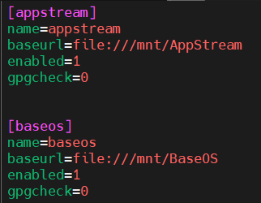
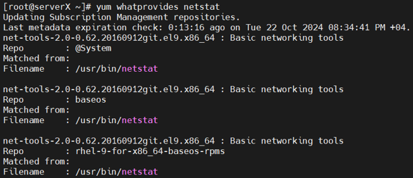

# Yum & RPM Tasks – Zeynalabdin Hamidov

Practical tasks on package management in RHEL using `yum`/`dnf` and RPM, including local repository creation, targeted installs, and dependency handling.

---

## 1. Create a Repository from Mounted Local CD-ROM

**Mount CD-ROM:**
```bash
sudo mount /dev/cdrom /mnt
```

**Create repo configuration:**
```bash
sudo tee /etc/yum.repos.d/local.repo <<EOF
[appstream]
name=appstream
baseurl=file:///mnt/AppStream
enabled=1
gpgcheck=0

[baseos]
name=baseos
baseurl=file:///mnt/BaseOS
enabled=1
gpgcheck=0
EOF
```


---

## 2. Verify Local Repo is Working

**Test:**
```bash
sudo yum clean all
sudo yum repolist
sudo yum update
```

If `yum update` runs without repo errors, the local repo is functioning correctly.

---

## 3. Check if `httpd` Package is Installed

**Command:**
```bash
yum list installed | grep httpd
```

If no output → package is not installed.

---

## 4. Install `httpd` from Local Repository and Remove It

**Install only from local repo:**
```bash
sudo yum install httpd --disablerepo="*" --enablerepo="appstream"
```

**Verify:**
```bash
rpm -q httpd
```

**Remove:**
```bash
sudo yum remove httpd -y
```

---

## 5. Find Which Package Provides a Command (e.g., `netstat`)

**Command (RHEL 8/9):**
```bash
dnf provides */netstat
# or (legacy)
yum whatprovides */netstat
```


**Expected:** It will show `net-tools` as the provider of `netstat`.

**Install it (if needed):**
```bash
sudo dnf install -y net-tools
netstat -tulnp | head
```

---

## 6. List All Groups (including hidden) & Install One

**List groups (show hidden):**
```bash
dnf group list --hidden
# or
yum group list hidden
```

**Install a group (example: Web Server):**
```bash
sudo dnf group install -y "Web Server"
# verify httpd and related packages
rpm -q httpd
```

**Remove a group (optional):**
```bash
sudo dnf group remove -y "Web Server"
```

---

## 7. Install Docker on RHEL 9 (with Docker CE repo)

> RHEL 9 ships with **Podman/Buildah** which can conflict with Docker CE. We’ll remove those, add the Docker repo, and install Docker CE.

**(a) Remove conflicting containers tools (if present):**
```bash
sudo dnf remove -y podman buildah runc
```

**(b) Install repo tools & add Docker CE repo:**
```bash
sudo dnf install -y dnf-plugins-core
sudo dnf config-manager --add-repo https://download.docker.com/linux/rhel/docker-ce.repo
sudo dnf makecache
```

**(c) Install Docker CE stack:**
```bash
sudo dnf install -y docker-ce docker-ce-cli containerd.io
```

> If you hit dependency issues, try:
```bash
sudo dnf install -y docker-ce --nobest
```

**(d) Enable & start Docker:**
```bash
sudo systemctl enable --now docker
sudo systemctl status docker --no-pager
```

**(e) Verify:**
```bash
docker --version
sudo docker run --rm hello-world
```

---

## 8. Undo the Last Yum/DNF Operation

**View history:**
```bash
dnf history
```

**Undo the last transaction:**
```bash
sudo dnf history undo last
```

**Undo a specific transaction by ID (example):**
```bash
sudo dnf history undo 42
```

**Recheck:**
```bash
dnf history
```

---

## 9. Concepts

### What is a Repository?
A **repository** is a store of RPM packages plus metadata used by `yum`/`dnf` to resolve installs, updates, and dependencies. Repos can be:
- **Official** (vendor-provided, e.g., RHEL BaseOS/AppStream)
- **Third-party** (e.g., EPEL, Docker CE)
- **Local** (e.g., mounted ISO/CD-ROM or internal mirror)

### What is a Dependency? What is Dependency Hell?
A **dependency** is a package a program needs to run. Package managers automatically resolve and install them.  
**Dependency hell** happens when versions conflict, circular dependencies appear, or required deps are unavailable. Modern `dnf/yum` greatly reduce this by solving dependency graphs automatically.

---
